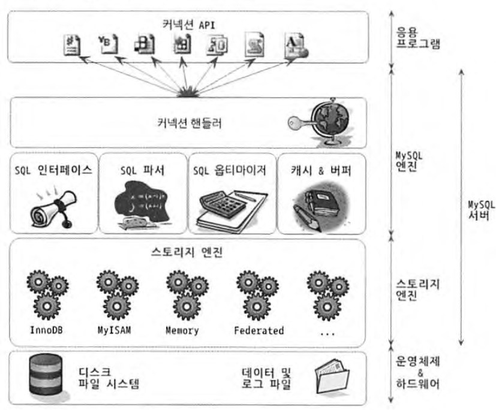
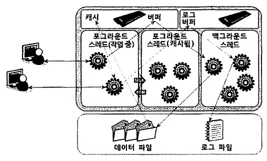
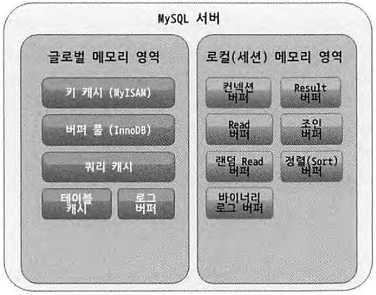
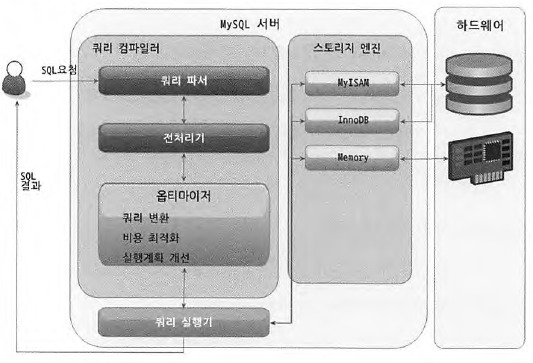

# 개요

공부할 챕터

- 3장 아키텍처
- 4장 트랜잭션
- 5장 인덱스
- 6장 실행 계획

메모

* 레플리케이션 실습
* 리드 레플리카 + 스프링

# 1. 3장 - 아키텍처

## 1.1. 전체 구조

엔진은 크게 두 영역으로 구분된다.  

- MySQL 엔진
- 스토리지 엔진

1. MySQL 엔진
   1. 커넥션 핸들러: 접속 및 쿼리 요청 처리
   2. SQL 파서 및 전처리기
   3. Optimizer
2. 스토리지 엔진
   1. SQL 문장 분석
   2. 최적화
   3. 읽기(영속화) & 쓰기
   4. 여러 개 사용 가능
3. 핸들러 API
   1. MySQL 엔진의 쿼리 실행기에서 스토리지에 데이터 쓰기/읽기 요청

## 1.2. MySQL 스레딩 구조

- 포그라운드(클라이언트 스레드)
  - 접속된 클라 수 만큼 존재
  - 클라가 요청하는 쿼리문 처리
  - 커넥션 종료 시 워커 스레드는 풀(pool)로
- 백그라운드 스레드
  - insert buffer 병합 스레드
  - 로그 기록 on disk
  - 버퍼 풀 기록 on disk
  - 버퍼에 데이터 로드 from disk
  - 잠금/데드락 모니터링
  - 메인 스레드

쓰기 작업은 지연(버퍼링) 처리를 할 수 있지만, 읽기는 절대로 지연될 수 없다.  

## 1.3. 메모리 할당 및 사용 구조

크게 두 가지 영역으로 나뉜다.  

- 글로벌 메모리
  - 모든 스레드에 의해 공유됨
  - 일반적으로는 하나의 메모리 공간
- 로컬 메모리
  - 세션 메모리 영역
  - 서버에 존재하는 클라이언트 스레드가 쿼리 처리에 사용하는 메모리 영역
  - 커넥션 버퍼
  - 소트 버퍼

## 1.4. 플러그인 스토리지 엔진 모델

- 플러그인 방식

## 1.5. 쿼리 실행 구조

1. 파서
   1. 토크나이징 (파서트리, AST)
   2. 문법 오류가 발견되는 과정
2. 전처리기
   1. 파서 트리로 구조적 문제점 검사
   2. 권한 검사는 이곳에서 체크
   3. 실제 조회할 대상이 있는지도 여기서 체크
3. 옵티마이저
   1. 문장 최적화
4. 실행 엔진
5. 핸들러(스토리지 엔진)
   1. 데이터 읽기/쓰기

## 1.6. 레플리케이션

마스터와 슬레이브가 바이너리 로그를 주고 받고, 슬레이브가 이를 리플레이해서 데이터를 동기화 시킨다.  

주의사항

- 슬레이브는 하나의 마스터만 설정 가능
- 슬레이브는 읽기 전용
- 슬레이브 서버 장비는 마스터와 동일한 사양으로
- 복제가 불필요하면 바이너리 로그는 중지
- 바이너리 로그와 트랜잭션 격리 수준

## 1.7. 쿼리 캐시

SQL 문장을 캐시하는 것이 아닌 쿼리 결과를 메모리에 캐시하는 기능.  

키-값 쌍의 맵으로 구현돼 있음. 여기서 키는 문장 자체, 값은 결과.  

쿼리 캐시를 내어주기 위한 조건은 다음과 같음.  

- 요청된 쿼리 문이 쿼리 캐시에 존재하는가?
- 요청한 사용자가 권한이 있나?
- 트랜잭션 내에서 실행된 쿼리의 경우 스코프 안에 있나?
- CURRENT_DATE, SYSDATE, RAND와 같이 호출마다 달라지는 요소가 존재하는가?
- 프리페어 스테이트먼트의 경우 변수가 결과에 영향을 미치는가?
- 캐시 생성 이후 해당 데이터가 다른 사용자에 의해 변경되었는가?
- 쿼리 결과가 캐시하기에 너무 크지 않은지?
- 쿼리 캐시를 사용하지 못할 요소가 존재하는가?
  - 임시 테이블
  - 사용자 변수 사용
  - 칼럼 기반의 권한 설정
  - LOCK IN SHARE MODE 힌트: SELECT 문장 끝에 붙여서 조회하는 레코드에 공유 잠금(읽기 락)을 설정하는 쿼리
  - FOR UPDATE 힌트: SELECT 문장의 끝에 붙여서 조회하는 레코드에 배타적 잠금(쓰기 락)을 설정하는 쿼리 (SELECT FOR UPDATE)
  - User Defined Function
  - 서브쿼리
  - Stored routine(procedure, function, trigger)에 사용된 쿼리
  - SQL_NO_CACHE 힌트

## 2.1. InnoDB 스토리지 엔진 특성

- 프라이머리 키에 의한 클러스터링
- 잠금이 필요 없는 읽관된 읽기(Multi Version Concurrency Control)
- 외래 키 지원
- 자동 데드락 감지
  - 데드락으로 인한 timeout 적음
  - 데드락으로 인한 슬로우 쿼리 적음
- 자동화된 장애 복구
  - Partial Write
- 오라클의 아키텍처 적용
  - MVCC
  - Undo가 시스템 테이블 스페이스에 관리

## 2.2. InnoDB 버퍼 풀

## 2.3. 언두(Undo) 로그

UPDATE, DELETE로 데이터 변경 시, 변경 전 데이터를 보관하는 곳

1. 트랜잭션 롤백 대비를 위함
2. 트랜잭션 격리 수준을 유지하면서 높은 동시성을 제공함

## 2.4. 인서트 버퍼(Insert Buffer)

INSERT, UPDATE 시 데이터 파일을 변경하는 작업뿐만 아니라 해당 테이블에 포함된 인덱스 업데이트 작업 필요하다. 하지만 랜덤 엑세스가 많아 자원 소모가 크다. 그때 필요한 버퍼이다.  

## 2.5. 리두(Redo) 로그 및 로그 버퍼

## 2.6. MVCC

레코드 레벨의 트랜잭션을 지원하는 DBMS가 제공하는 기능  

잠금을 사용하지 않는 일관된 읽기를 제공하는 것이 목적.  

InnoDB는 언두 로그로 이 기능을 구현한다.  

멀티 버전이라 함은 하나의 레코드에 대해 여러 개의 버전이 동시에 관리된다는 의미.  